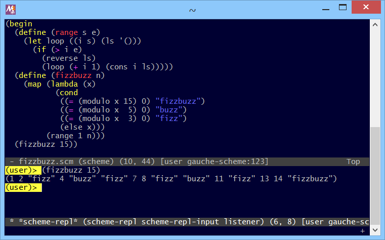

# r7rs-swank-Gauche-custom



## 概要
- r7rs-swank server ( https://github.com/ecraven/r7rs-swank ) (コミット 33b94e3 (2019-7-2))  
  を、Gauche 用に改造したものです。

- 現状、Lem エディタ ( https://github.com/cxxxr/lem ) での使用のみ考慮しています。


## インストール方法
- 事前に Lem エディタ および Gauche がインストールされている必要があります。

- 本サイト ( https://github.com/Hamayama/r7rs-swank-Gauche-custom ) のソースを、  
  (Download Zip ボタン等で) ダウンロードして、適当なフォルダに展開してください。

- そして、Lem エディタの設定ファイル ~/.lem/init.lisp 内に、以下の記述を追加してください。
  ```
  (setf lem-scheme-mode:*scheme-swank-server-run-command*
        '("gosh" "-AC:/work/r7rs-swank-Gauche-custom" "-e(begin (import (gauche-swank)) (start-swank ,port))"))
  ```
  **(※) 上記の -A オプションの部分には、展開したフォルダのパスを指定してください。**


## 使い方
- Lem エディタを起動して、M-x scheme-slime を実行すると、  
  r7rs-swank server が起動して、repl のバッファが表示されます。  
  後は、通常の Gauche の repl と同じように使うことができます。

- また、後述の機能のうち、対応しているものを利用できます。  
  (基本的に、repl を起動して、ファイルのロード後に、使用可能になります)


## 機能
- 以下に機能の対応状況を示します。
  
  |<div align="center">機能</div>|<div align="center">Lem エディタのコマンド</div>|<div align="center">r7rs-swank</div>|<div align="center">r7rs-swank-Gauche-custom</div>|
  |---|---|---|---|
  |repl の起動           |M-x scheme-slime                          |○     |○(※1)|
  |ファイルのロード      |M-x scheme-load-file (C-c C-l)            |△(※2)|○     |
  |シンボルの補完        |M-x indent-line-and-complete-symbol (Tab) |○     |○     |
  |autodoc による関数シグネチャ<br>のミニバッファへの自動表示|-     |△(※3)|△(※3)|
  |マクロの展開          |M-x scheme-macroexpand-all (C-c M-m)      |△(※4)|△(※5)|
  |describe による symbol の説明の表示|M-x scheme-describe-symbol (C-c C-d d)|△(※6)|△(※6)|
  |apropos 関係          |-                                         |×     |×     |
  |inspector 関係        |-                                         |×     |×     |
  |debugger 関係         |-                                         |×     |×     |
  |compile 関係          |-                                         |×     |×     |
  |定義位置へのジャンプ  |M-x find-definition (M-.)                 |×     |△(※7)|
  |参照情報の一覧表示 (xref?)|-                                     |×     |×     |
  |ローカル環境の情報取得|-                                         |×     |×     |
  |インデント情報の更新  |-                                         |×     |×     |
  |カレントライブラリの切り換え|M-x scheme-set-library (C-c M-p)    |×     |○(※8)|
  |repl の interrupt     |-                                         |×     |×     |
  
  ○:対応  
  △:問題あり  
  ×:未対応  
  
  (※1) ,a 等のトップレベルコマンドも使用可能  
  (※2) 現状、バグがあり Gauche では動作しない ( https://github.com/ecraven/r7rs-swank/pull/11 )  
  (※3) 引数にリストがあると、シグネチャのハイライトがずれる  
  (※4) 結果が1行になるので見にくい  
  (※5) pprint の結果を受け取ることで、ある程度改行されるようになった  
  (※6) 説明は表示されないが、bind 情報だけは表示される  
  (※7) 一部のグローバルな手続きのみ対応 (プリコンパイルされたものは不可)  
  (※8) 入力は R7RS 形式 (最外の括弧は省略可) と Gauche のモジュール (ドット区切り) の両方を受け付ける


## 環境等
- OS
  - Windows 8.1 (64bit)
- 言語
  - Gauche v0.9.8
- ライセンス
  - オリジナルと同様とします


## 履歴
- 2019-10-17 v1.00 (初版)


(2019-10-17)
